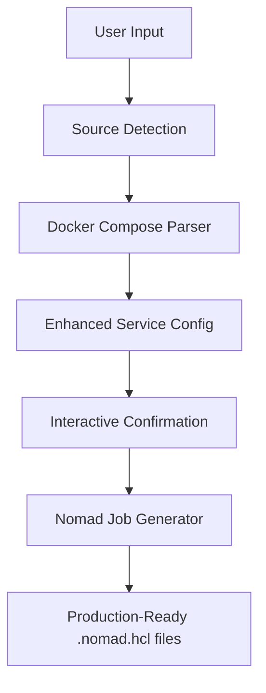

## **🎯 Project Overview**

**Nompose** is a CLI tool that converts Docker Compose configurations into production-ready Nomad job specifications. It bridges the gap between Docker development workflows and Nomad production deployments through smart detection, interactive confirmation, and automated generation.

### **Core Value Proposition**
- **Zero Learning Curve**: Use familiar docker-compose.yml files to deploy on Nomad
- **Production-Ready Output**: Generate optimized Nomad jobs with best practices
- **Interactive Intelligence**: Smart detection with user confirmation and customization
- **Multi-Service Support**: Handle complex applications with dependencies

---

## **🏗️ Architecture Overview**

### **High-Level Flow**
```
Docker Compose → Detection → Interactive Confirmation → Nomad Jobs
```

### **System Components**

```
nompose/
├── cmd/                    # CLI Interface Layer
│   ├── root.go            # Main command setup
│   ├── generate.go        # Core generate command
│   ├── version.go         # Version information
│   └── templates.go       # Supported types info
├── internal/              # Core Business Logic
│   ├── types/             # Data structures
│   ├── detector/          # Source type detection
│   ├── parser/            # Docker Compose parsing
│   ├── interactive/       # User confirmation system
│   └── generator/         # Nomad job generation
└── examples/              # Sample files for testing
```

### **Data Flow Architecture**



---

## **🔧 Technical Implementation**

### **Core Data Structures**

#### **EnhancedServiceConfig**
Central data model preserving all docker-compose information:
```go
type EnhancedServiceConfig struct {
    Name            string                 // Service identifier
    OriginalService DockerComposeService   // Complete docker-compose data
    ResolvedImage   string                 // Final image after user input
    ResolvedPorts   []PortMapping         // Processed port mappings
    Environment     map[string]string      // Flattened environment variables
    Dependencies    []string               // Service dependencies
}
```

#### **Communication Pattern**
Each module communicates through well-defined interfaces:
```
String Input → DetectionResult → []EnhancedServiceConfig → []EnhancedServiceConfig → Files
```

### **Smart Detection Engine**

**Source Type Detection:**
- `docker-compose.yml` → Multiple Nomad jobs
- `Dockerfile` → Single Nomad job (future)
- `nginx:latest` → Single Nomad job (future)
- Local directories → Analysis and generation (future)

**Intelligence Features:**
- **Framework Detection**: Identifies specific frameworks within docker-compose
- **Port Extraction**: Parses complex port configurations (`8080:80`, objects, arrays)
- **Environment Processing**: Handles both array and object environment formats
- **Dependency Resolution**: Creates proper deployment order
- **Resource Estimation**: Smart CPU/memory allocation based on service patterns

### **Interactive Confirmation System**

**Build Scenario Handling:**
```yaml
# When docker-compose has:
api:
  build: ./api

# User gets options:
# 1. I have the image ready (enter name)
# 2. Build it locally now (auto docker build)  
# 3. I'll build and push later (enter final name)
```

**User Experience Flow:**
1. Show detected configurations
2. Allow line-by-line editing
3. Handle build scenarios intelligently
4. Validate required fields
5. Provide clear next steps

---

## **📊 Feature Matrix**

### **Current Features (Phase 1: Docker Compose)**

| Feature | Status | Description |
|---------|--------|-------------|
| **Smart Source Detection** | ✅ Complete | Auto-detects docker-compose files |
| **Multi-Service Parsing** | ✅ Complete | Handles complex docker-compose configurations |
| **Interactive Confirmation** | ✅ Complete | User can review/edit all detected settings |
| **Build Image Handling** | ✅ Complete | Smart options for build vs image scenarios |
| **Multiple Port Support** | ✅ Complete | Supports complex port mappings |
| **Environment Variables** | ✅ Complete | Full environment variable processing |
| **Smart Resource Allocation** | ✅ Complete | CPU/memory based on service patterns |
| **Dependency Detection** | ✅ Complete | Identifies service dependencies |
| **Production-Ready Jobs** | ✅ Complete | Generates optimized .nomad.hcl files |
| **Service Registration** | ✅ Complete | Automatic service discovery configuration |
| **Health Checks** | ✅ Complete | TCP health checks with docker-compose integration |

### **Phase 2: Single Docker Sources (Planned)**

| Feature | Status | Description |
|---------|--------|-------------|
| **Dockerfile Analysis** | 🚧 Planned | Generate jobs from Dockerfiles |
| **Docker Image Analysis** | 🚧 Planned | Generate jobs from image inspection |
| **Registry Integration** | 🚧 Planned | Handle image pulling and authentication |
| **Build Automation** | 🚧 Planned | Automated docker build integration |

### **Phase 3: Advanced Features (Future)**

| Feature | Status | Description |
|---------|--------|-------------|
| **Local Directory Analysis** | 🚧 Future | Detect frameworks in source code |
| **GitHub Repository Support** | 🚧 Future | Clone and analyze remote repositories |
| **Advanced Resource Detection** | 🚧 Future | ML-based resource requirement prediction |
| **Volume Management** | 🚧 Future | Intelligent volume configuration |
| **Network Policies** | 🚧 Future | Advanced networking configuration |
| **Secrets Management** | 🚧 Future | Vault integration and secret handling |

---

## **🚀 Usage Guide**

### **Installation**
```bash
# Build from source
git clone https://github.com/username/nompose
cd nompose
go build -o nompose .

# Or download binary (future)
# wget https://releases.github.com/nompose/latest
```

### **Quick Start**
```bash
# Basic usage
nompose generate docker-compose.yml

# The tool will:
# 1. Detect and parse your docker-compose file
# 2. Show detected configurations
# 3. Ask for confirmation/modifications
# 4. Generate production-ready .nomad.hcl files
```

### **Example Workflow**

#### **Input (docker-compose.yml):**
```yaml
version: '3.8'
services:
  web:
    image: nginx:alpine
    ports: ["8080:80"]
    depends_on: [api]
  
  api:
    build: ./api
    ports: ["3000:3000"]
    environment:
      DATABASE_URL: postgres://user:pass@db:5432/app
```

#### **Interactive Session:**
```
🔍 Analyzing source: docker-compose.yml
✅ Detected source type: docker-compose
✅ Found 2 services:
   1. web (nginx:alpine)
   2. api ({{BUILD_REQUIRED:./api}})

🔧 Let's review and confirm the detected configurations...

📦 Service 1/2: web
──────────────────────────────────────────────────
   Service name: web
   Keep this value? (Y/n): [ENTER]
   Image: nginx:alpine
   Keep this value? (Y/n): [ENTER]
   Ports detected:
     1. 8080:80 (tcp)
   Keep these port mappings? (Y/n): [ENTER]

📦 Service 2/2: api
──────────────────────────────────────────────────
   🔨 Build configuration detected
   Build context: ./api
   
   How would you like to handle the Docker image?
   1. I have the image ready (enter image name/tag)
   2. Build it locally now (auto docker build)
   3. I'll build and push later (enter final image name)
   
   Choice [1-3]: 1
   Enter image name (e.g., my-app:latest): my-api:v1.0
```

#### **Generated Output:**
```
📝 Generating production-ready Nomad job files...
✅ Generated 2 Nomad job files:
   1. web.nomad.hcl
   2. api.nomad.hcl

🚀 Next steps:
   Deploy services:
   nomad job run web.nomad.hcl
   nomad job run api.nomad.hcl
```

#### **Generated File (web.nomad.hcl):**
```hcl
# Generated by Nompose - Production Ready
# Service: web
# Image: nginx:alpine
# Ports: 8080

job "web" {
  datacenters = ["dc1"]
  type        = "service"

  group "web" {
    count = 1

    network {
      port "http" {
        static = 8080
      }
    }

    task "app" {
      driver = "docker"

      config {
        image = "nginx:alpine"
        ports = ["http"]
      }

      resources {
        cpu    = 300
        memory = 512
      }

      service {
        name = "web"
        port = "http"
        tags = ["docker", "web", "nompose"]

        check {
          type     = "tcp"
          interval = "30s"
          timeout  = "3s"
          port     = "http"
        }
      }

      # Dependencies: api
      # Deploy dependencies first!
    }
  }
}
```

---

## **📈 Business Value & Impact**

### **Developer Productivity**
- **10x faster deployment**: From hours of manual Nomad job writing to minutes
- **Zero learning curve**: Use familiar docker-compose syntax
- **Reduced errors**: Automated generation eliminates manual mistakes
- **Best practices**: Built-in Nomad optimization and security practices

### **Organizational Benefits**
- **Faster cloud migration**: Easy path from Docker development to Nomad production
- **Reduced DevOps overhead**: Less specialized Nomad knowledge required
- **Consistent deployments**: Standardized job generation across teams
- **Lower operational costs**: Optimized resource allocation

### **Market Positioning**
- **Unique value**: No existing tool provides docker-compose → Nomad conversion
- **Growing market**: Nomad adoption increasing, especially for edge computing
- **Clear differentiation**: Focus on Nomad vs Kubernetes ecosystem tools

---

## **🛣️ Roadmap & Next Steps**

### **Immediate Priorities (Next 2-4 weeks)**

#### **1. Production Hardening**
- **Error handling**: Comprehensive error scenarios and recovery
- **Edge cases**: Complex docker-compose configurations
- **Performance**: Large multi-service applications
- **Validation**: Generated job syntax verification

#### **2. Enhanced Features**
- **Deployment scripts**: Auto-generate deploy-all.sh and README.md
- **Volume handling**: Intelligent volume configuration suggestions
- **Health checks**: Enhanced health check detection from docker-compose
- **Restart policies**: Convert docker-compose restart policies

#### **3. User Experience**
- **CLI improvements**: Better error messages and help text
- **Configuration**: User preferences and defaults
- **Logging**: Verbose mode and debugging capabilities

### **Phase 2: Expanded Source Support (1-2 months)**

#### **Dockerfile Support**
```bash
nompose generate Dockerfile
# Analyzes Dockerfile and generates single Nomad job
```

**Implementation approach:**
- Parse Dockerfile instructions (EXPOSE, ENV, WORKDIR, etc.)
- Detect base image and extract configuration
- Generate appropriate Nomad job with smart defaults

#### **Docker Image Support**
```bash
nompose generate nginx:alpine
# Inspects image and generates Nomad job
```

**Implementation approach:**
- Use `docker inspect` to analyze image metadata
- Extract ports, environment, volumes from image
- Generate minimal but functional Nomad job

#### **Registry Integration**
- Support for private registries
- Authentication handling
- Image pulling strategies

### **Phase 3: Advanced Intelligence (2-4 months)**

#### **Local Directory Analysis**
```bash
nompose generate ./my-go-api
# Analyzes source code and generates Nomad job + Dockerfile
```

**Features:**
- Framework detection (Go, Node.js, Python, etc.)
- Port detection from source code
- Dependency analysis
- Automatic Dockerfile generation

#### **GitHub Repository Support**
```bash
nompose generate https://github.com/user/awesome-app
# Clones, analyzes, and generates deployment
```

**Features:**
- Automatic repository cloning
- Multi-framework detection
- CI/CD integration suggestions
- Deployment pipeline generation

#### **Machine Learning Integration**
- **Resource prediction**: ML models for optimal CPU/memory allocation
- **Performance optimization**: Historical data analysis for tuning
- **Anomaly detection**: Identify unusual configurations

### **Phase 4: Enterprise Features (4-6 months)**

#### **Advanced Nomad Features**
- **Multi-region deployment**: Global service distribution
- **Constraint handling**: Node placement optimization
- **Preemption policies**: Resource priority management
- **CSI volume integration**: Persistent storage handling

#### **Security & Compliance**
- **Vault integration**: Automatic secret management
- **Policy as Code**: Security policy enforcement
- **Compliance scanning**: Automated security checks
- **Audit logging**: Deployment tracking and compliance

#### **Operations & Monitoring**
- **Metrics integration**: Prometheus/Grafana setup
- **Logging configuration**: Centralized log management
- **Alerting**: Automated monitoring setup
- **Performance tuning**: Continuous optimization

### **Phase 5: Platform & Ecosystem (6+ months)**

#### **Platform Expansion**
- **Web interface**: Browser-based conversion tool
- **IDE plugins**: VS Code, IntelliJ integration
- **CI/CD integrations**: GitHub Actions, GitLab CI
- **Cloud marketplace**: AWS, Azure, GCP listings

#### **Ecosystem Integration**
- **Terraform integration**: Infrastructure as code
- **Helm chart converter**: Kubernetes → Nomad migration
- **Service mesh**: Consul Connect integration
- **Observability**: Jaeger, Zipkin integration

---

## **🔧 Technical Architecture Evolution**

### **Current Architecture Strengths**
- **Modular design**: Clear separation of concerns
- **Extensible**: Easy to add new parsers and generators
- **Type-safe**: Strong Go typing with comprehensive data structures
- **Testable**: Each module can be tested independently

### **Planned Architectural Improvements**

#### **Plugin System**
```go
// Future plugin architecture
type Parser interface {
    Parse(source string) ([]ServiceConfig, error)
    Supports(source string) bool
}

type Generator interface {
    Generate(services []ServiceConfig) error
    OutputFormat() string
}
```

#### **Configuration Management**
```yaml
# ~/.nompose/config.yml
defaults:
  datacenter: "production"
  cpu_multiplier: 1.5
  memory_multiplier: 1.2
  
generators:
  nomad:
    version: "1.6"
    features: ["csi", "consul", "vault"]
    
integrations:
  vault:
    address: "https://vault.company.com"
  consul:
    address: "https://consul.company.com"
```

#### **Advanced Resource Intelligence**
```go
// ML-based resource prediction
type ResourcePredictor struct {
    Model *tensorflow.SavedModel
}

func (rp *ResourcePredictor) PredictResources(
    serviceType string,
    dependencies []string,
    codeMetrics CodeMetrics,
) (cpu, memory int) {
    // Use trained model to predict optimal resources
}
```

---

## **📊 Success Metrics & KPIs**

### **User Adoption Metrics**
- **Downloads/installations**: Track tool adoption
- **Generated jobs**: Number of successful conversions
- **User retention**: Repeat usage patterns
- **Community engagement**: GitHub stars, issues, contributions

### **Quality Metrics**
- **Success rate**: Percentage of successful job generations
- **Deployment success**: Generated jobs that deploy successfully
- **Resource efficiency**: CPU/memory utilization improvements
- **Time savings**: Reduction in deployment preparation time

### **Business Impact**
- **Migration acceleration**: Docker → Nomad migration timelines
- **Cost reduction**: Infrastructure cost savings from optimization
- **Developer productivity**: Time-to-deployment improvements
- **Error reduction**: Decrease in deployment failures

---

## **🤝 Contributing & Community**

### **Open Source Strategy**
- **Apache 2.0 License**: Commercial-friendly licensing
- **Community-driven**: Accept contributions and feature requests
- **Documentation-first**: Comprehensive guides and examples
- **Plugin ecosystem**: Allow community-built extensions

### **Development Workflow**
```bash
# Standard development process
git clone https://github.com/user/nompose
cd nompose
go test ./...           # Run all tests
go build -o nompose .   # Build binary
./nompose --help        # Verify functionality
```

### **Testing Strategy**
- **Unit tests**: Each module thoroughly tested
- **Integration tests**: End-to-end workflow verification
- **Example library**: Diverse docker-compose samples
- **Regression testing**: Prevent feature breakage

---

## **🎯 Conclusion**

**Nompose represents a significant opportunity to simplify and accelerate Nomad adoption** by providing a familiar, intelligent bridge from Docker development workflows to production Nomad deployments.

### **Key Differentiators**
1. **First-to-market**: No existing docker-compose → Nomad conversion tool
2. **Production-ready**: Generates optimized, best-practice Nomad jobs
3. **Intelligent automation**: Smart detection with user confirmation
4. **Extensible architecture**: Built for long-term feature expansion

### **Strategic Value**
- **Technical**: Solves real developer pain points in cloud migration
- **Business**: Reduces deployment complexity and accelerates time-to-market
- **Market**: Positions for growing Nomad ecosystem and edge computing trends

**The foundation is solid, the market need is clear, and the expansion opportunities are substantial.** Nompose is positioned to become an essential tool in the modern DevOps toolkit.

---

*This documentation represents the current state and future vision of Nompose. As the project evolves, this documentation will be updated to reflect new features, architectural changes, and community feedback.*
